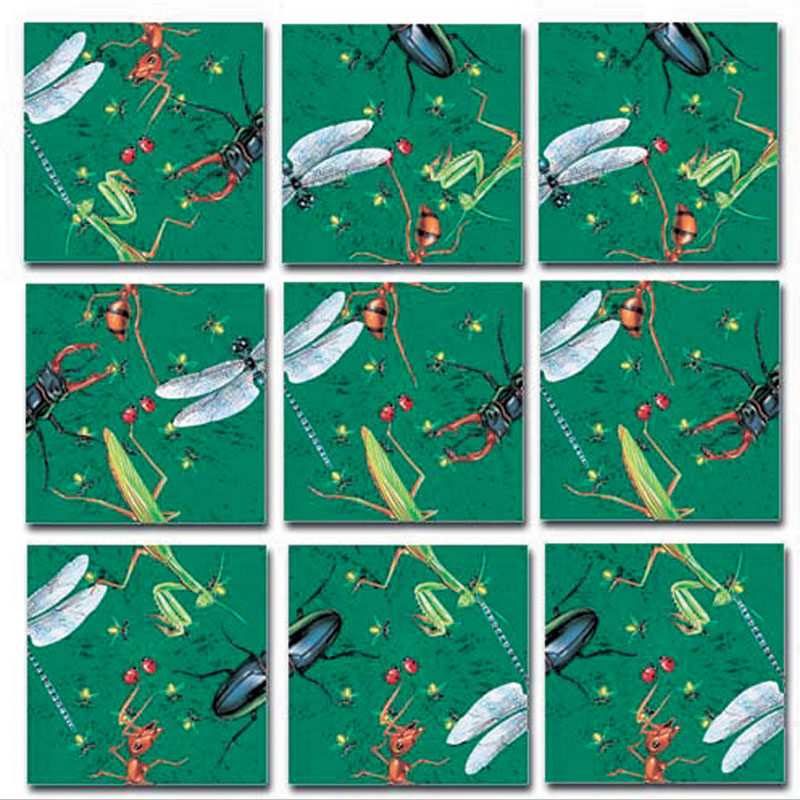

# Scramble Squares Solver <!-- omit in toc -->

A puzzle solving program written in a variety of languages.

- [Motivation](#motivation)
- [Solutions](#solutions)
- [Benchmarks](#benchmarks)

## Motivation

One holiday at a friend's house, I found a puzzle with a simple premise--arrange these nine pieces so all the edges line
up. I spent hours with it, and got within one piece of a solution at least ten different ways, but could not solve it.
Time to write a program.

The puzzle was of the "Scramble Squares" variety. You can find it
[here](https://www.puzzlewarehouse.com/Insects-10028ss.html) and
[here](https://www.amazon.com/B-Dazzle-10028-Scramble-Squares-Insects/dp/B000021Z0S). The idea is that each touching
edge must have a complete insect. For example, if you have the head of a beetle on the right edge of the left piece, you
must have the abdomen of a beetle on the left edge of the right piece. Edges on the perimeter of the puzzle do not
matter.

Here's a picture of what it looks like unsolved:

  

## Solutions

This program was originally written in C--_not_ because that's the best language for the problem, but because that was
my strongest language at the time. In order to get practice with new languages, I added solutions in Go, Haskell, Rust,
and Clojure.

Each implementation uses the same high-level algorithm. Data structures represent boards as arrangements of pieces and
pieces as arrangements of sides. The algorithm places one piece at a time with each possible rotation. If the resulting
board position is valid, it recursively places the next piece. When it has placed all nine pieces successfully, it has
found a solution. Solutions are printed out as `(piece, rotation)` tuples. The algorithm doesn't account for rotations,
so it finds four solutions.

What follows is a few notes on what makes each solution unique.

<!--
TODO: for blog post, create new repo designed to collect solutions!

- Update benchmark.sh to collect stats and name champions for each language
  - code golf
  - execution time
  - memory usage
- Maybe document all the algorithms employed
- Accept all solutions, but require standard based on benchmark.sh expectations (e.g. make)
- Probably standardize output so can automatically check correctness
  - As part of established rules
  - Probably need to make rules about libraries too. Only standard libraries? Only for printing and
      basic data types?
  - If competing for sloc, must use standardized formatting tool?
-->

### C

C is not the simplest language for this problem, but it is the language in which I have the most experience. Though it
is actually shorter and less complex than the Go and Rust solutions, that is probably only because of my familiarity
with the language. It does require the programmer to do more of the mental lifting.

The memory usage usage is worth some discussion. I am pleased that my intuition guided me to make copies of the board at
each level. Since C allows mutation and low level memory handling, one may be tempted to have a global copy of the board
on which to add and remove pieces; making copies of the board on the stack in a recursive function seems dangerous.
However, since this implementation is depth-first and bounded at nine layers, even if the program checks tens of
thousands of board positions, there are only ever nine boards on the stack at once, making the cost trivial. Even in a
single thread, correctly managing mutation can be difficult. As we'll see later, Rust addresses this through ownership
and borrowing, and as Haskell and Clojure address it by making mutation illegal. <!-- trim down -->

### Go

The Go solution uses Goroutines to search for a solution in parallel. It was a fairly straightforward port from C,
though methods made the code easier to write and understand.

<!-- wanted to use struct methods, so got fancier and copied complete boards -->
<!-- does not print pretty -->
<!-- looking back, still feels pretty low level -->

### Haskell

The Haskell solution is quite elegant. It is far simpler, and actually runs in approximately the same time as the Go
solution.

<!-- most elegant in my opinion -->
<!-- implemented breadth-first search, kind of by accident -->

### Rust

The Rust solution feels like a mix of the C, Go, and Haskell solutions. It's memory usage and macro system felt like C,
though improved. It's object methods and overall structure felt like Go. The functional-_lite_ features felt like
Haskell, though clunky.

<!--
The Rust solution feels like a mix of the C, Go, and Haskell solutions. It's memory usage felt like C. Of course, Rust
is safe, but the way to think about memory felt the same. Rust's macro system, similarly, is more powerful yet has a
familiar feel. It's object methods felt like Go. The overall structure of the program was extremely similar, and the LOC
and Complexity metrics match almost exactly. The pattern matching and functional-_lite_ capability felt like Haskell.
Programming functionally in Rust is not natural, but having the capability when it is particularly convenient is really
nice.
-->
<!-- edit -->

### Clojure

The Clojure solution is a direct port of the Haskell solution. I never quite grokked Clojure's REPL-oriented development
workflow. Despite the awkwardness of my Clojure style, I think its syntax is slightly more understandable, if not truly
pleasant.

<!-- solution also feels elegant, similar to haskell -->
<!-- couldn't get the workflow down, so debugging was hard -->
<!-- never has an auto-formatter been so necessary -->

## Benchmarks

Note that the implementation in each language is relatively basic; none have been particularly optimized for size or
performance.

LOC and Complexity are reported by [scc](https://github.com/boyter/scc). The C application is built with static linkage.
The rest are with whatever is default.

The LOC and complexity comparisons are not entirely fair, as each program implements a slightly different set of
features. For example, the Go solution implements parallelism, which is trivial in Go but would add considerable
complexity to some other languages. The Rust solution implements nicely-formatted solution print via `fmt::Display for
Board`, which alone accounts for 27 LOC and 7 points of complexity. For a fairer comparison, each language should
implement the same features.

The tool also fails to measure the complexity of the Clojure solution, which really should be about the same as the
Haskell solution. Consider from the [scc
README](https://github.com/boyter/scc/blob/850e8be775dac636f9da5864b26974b123269bd2/README.md):

>The complexity estimate is really just a number that is only comparable to files in the same language. It should not be
used to compare languages directly without weighting them. The reason for this is that its calculated by looking for
branch and loop statements in the code and incrementing a counter for that file.  
Because some languages don't have loops and instead use recursion they can have a lower complexity count. Does this mean
they are less complex? Probably not, but the tool cannot see this because it does not build an AST of the code as it
only scans through it.

There are three sets of benchmarks: the [Puzzle](#puzzle) benchmarks run the puzzle solving applications. The
[Baseline](#baseline) benchmarks run a dummy application that performs each language's version of `return 0;`. The
[Difference](#difference-baseline---puzzle) benchmarks are calculated as `Puzzle - Baseline`. The purpose of these
separate sets is to identify the benchmark values for each version that are due to the application vs due to the
languages and toolsets themselves.

### Puzzle

| Language |  LOC  | Complexity | Build time (s) | Exe Size (KB) | 10x Runtime (s) | Mem: RSS (KB) |
|:--------:|:-----:|:----------:|:--------------:|:-------------:|:---------------:|:-------------:|
| c        | 100   | 15         | 0.11           | 825           | 0.01            | 2980          |
| go       | 123   | 18         | 0.26           | 1416          | 0.44            | 7572          |
| haskell  | 71    | 6          | 1.13           | 1071          | 0.46            | 4012          |
| rust     | 125   | 18         | 0.95           | 2578          | 0.13            | 2868          |
| clojure  | 56    | 0          | 7.55           | 3629          | 32.97           | 255240        |

### Baseline

| Language |  LOC  | Complexity | Build time (s) | Exe Size (KB) | 10x Runtime (s) | Mem: RSS (KB) |
|:--------:|:-----:|:----------:|:--------------:|:-------------:|:---------------:|:-------------:|
| c        | 5     | 0          | 0.08           | 824           | 0.00            | 2916          |
| go       | 4     | 0          | 0.14           | 788           | 0.01            | 2824          |
| haskell  | 4     | 0          | 0.63           | 969           | 0.01            | 3380          |
| rust     | 3     | 0          | 0.20           | 2557          | 0.00            | 2792          |
| clojure  | 7     | 0          | 7.35           | 3602          | 16.95           | 95672         |

### Difference: Baseline -> Puzzle

| Language |  LOC  | Complexity | Build time (s) | Exe Size (KB) | 10x Runtime (s) | Mem: RSS (KB) |
|:--------:|:-----:|:----------:|:--------------:|:-------------:|:---------------:|:-------------:|
| c        | 95    | 15         | 0.03           | 1             | 0.01            | 64            |
| go       | 119   | 18         | 0.12           | 628           | 0.43            | 4748          |
| haskell  | 67    | 6          | 0.50           | 102           | 0.45            | 632           |
| rust     | 122   | 18         | 0.75           | 21            | 0.13            | 76            |
| clojure  | 49    | 0          | 0.20           | 27            | 16.02           | 159568        |
